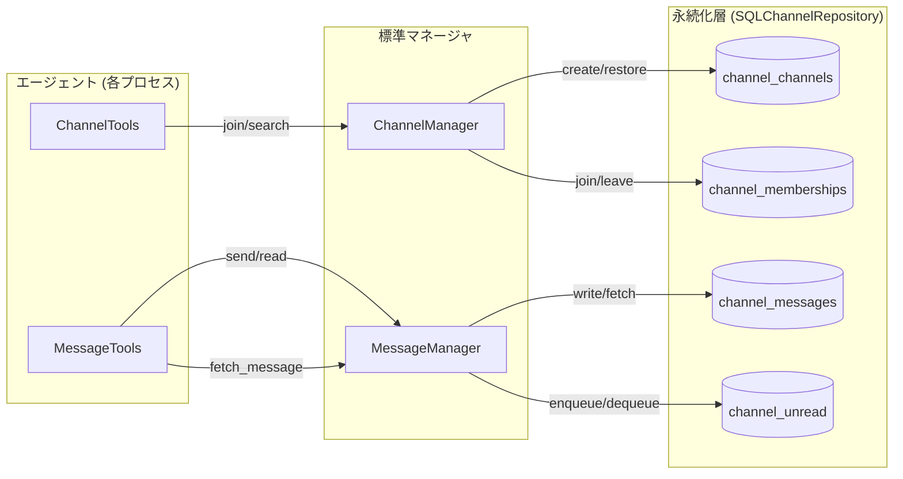

# チャンネルとメッセージ処理の概要（人間向けメモ）

このドキュメントは、開発者が「エージェント間メッセージがどの層でどう扱われるか」を素早く把握できるようにまとめた概要です。設計詳細は [docs/specs/channel_spec.md](../specs/channel_spec.md) や [docs/exec_plan_message_database.md](../exec_plan_message_database.md) を参照してください。

## 全体像
- **チャネル管理**: `ChannelManager` がチャネル ID の発番、メタデータ登録、エージェントの参加/離脱を担当します。所属情報は `channel_channels`（チャネル定義）と `channel_memberships`（所属）に保存されます。
- **メッセージ配送**: `MessageManager` がメッセージを永続化 (`channel_messages`) し、受信エージェントごとの未読キュー (`channel_unread`) にポインタを投入します。バックエンドは InMemory/SQL を自動選択します。
- **ツール層の責務分離**:
  - `ChannelTools` … チャネルメタデータと参加管理に特化。`join/leave/search/join_matching` を提供。
  - `MessageTools` … メッセージ送受信 (`send/read`)、未読スナップショット (`snapshot_unread`)、履歴再取得 (`fetch_message(s)`)、チャネル全体の履歴一覧 (`list_channel_messages`) を担当。
- **既読の扱い**: `MessageTools.read()` が `channel_unread` から該当行を取り出して削除 → 既読扱い。既読 ID を保持しておけば、再起動後も `fetch_message(s)` で同じ本文を取得可能です。

## 典型的なフロー
1. **チャネル生成**: 管理エージェントまたは初回投稿エージェントが `ChannelManager.create(...)` を呼び、`channel_channels` にチャネルを登録。
2. **参加**: エージェントは `ChannelTools.join()` でチャネルへ登録され、`channel_memberships` に所属が記録される（マネージャ側で事前参加させる場合も同様）。
3. **送信**: `MessageTools.send()` が `MessageManager.write()` を呼び、`channel_messages` に本文保存後、未読キューへポインタを投入。
4. **受信**: 受信側が `MessageTools.read()`。`channel_unread` から最優先メッセージを取得→削除し、`channel_messages` から本文を読み戻す。
5. **再参照/復元**: エージェントが保持している `(channel_id, message_id)` を `fetch_message(s)` に渡すことで既読メッセージを再取得でき、`list_channel_messages()` でチャネル全体の履歴をダンプして状態点検にも利用できる。

## コンポーネント関係図

## 再起動対応のポイント
- SQLite/PostgreSQL バックエンドでは未読キューも DB に保存されるため、プロセス再起動後も `MessageTools.read()` が途切れない。
- 既読メッセージを再構築したい場合は、エージェント側で `message_id` を状態として保存し、起動時に `fetch_messages()` を呼んで LLM へのコンテキストなどに利用する。
- InMemory バックエンドを利用する軽量構成では、`MessageTools.save()` により `ChannelRepository.replace_unread_records()` が呼ばれ、未読スナップショットを明示的に保存する必要があります。

## 便利な参照ドキュメント
- [docs/specs/channel_spec.md](../specs/channel_spec.md): コンポーネントごとの責務・決定事項。
- [docs/exec_plan_message_database.md](../exec_plan_message_database.md): DB バックエンド実装の背景と手順。
- [docs/channel_persistence_plan.md](../channel_persistence_plan.md): テーブル設計と Docker/PostgreSQL 連携方針。
- `samples/in_memory_channels.py`: ChannelTools / MessageTools を組み合わせた最小サンプル。
