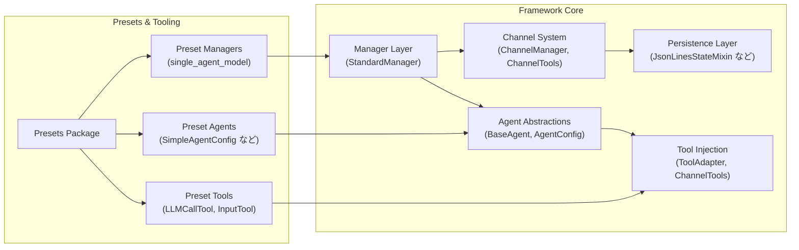

# ライブラリ構造マップ

この資料は、エージェント・マネージャ・チャネルなどライブラリ内部の主要コンポーネントと依存関係をマーメイド図で俯瞰します。ディレクトリ構成については `docs/directory_structure.md` を参照してください。

## Mermaid 図

## コンポーネント概要
- `Agent Abstractions` : エージェント共通のライフサイクル管理・ツール注入インタフェースを定義し、プリセットや拡張エージェントがここを基盤に構築されます。
- `Manager Layer` : チャネル管理やエージェントの初期化責務を統合し、プリセットマネージャを通じて利用者が再利用します。
- `Channel System` : メッセージキュー、チャネル検索、未読管理などの共通処理を提供し、マネージャとエージェント双方から呼び出されます。
- `Persistence Layer` : エージェント・チャネル両方の状態永続化を担当し、既定実装として JSON Lines ベースのミックスインを用意します。
- `Presets Package` : 実用的な構成例を束ね、標準マネージャ／エージェント実装とツールセットを差し替え可能にします。
