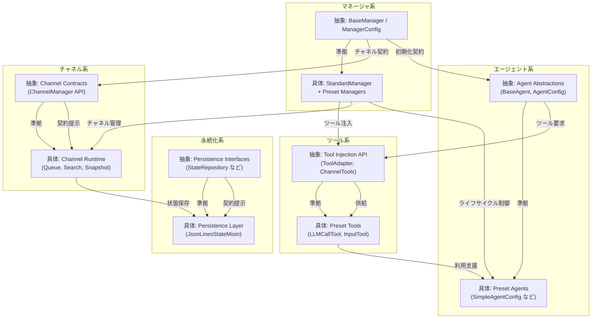

# ライブラリ構造マップ

この資料は、エージェント・マネージャ・チャネルなどライブラリ内部の主要コンポーネントと依存関係をマーメイド図で俯瞰します。ディレクトリ構成については [docs/directory_structure.md](./directory_structure.md) を参照してください。

## Mermaid 図

## コンポーネント概要
- **エージェント系**：`BaseAgent`・`AgentConfig` などの抽象契約を起点に、`SimpleAgentConfig` などプリセットエージェントが具体実装として従います。
- **マネージャ系**：`BaseManager` とその設定契約を基礎とし、`StandardManager` やプリセットマネージャがオーケストレーションを担います。
- **チャネル系**：`ChannelManager` API などの契約が、優先度キューや検索・参加処理を備えたランタイム実装へつながります。
- **永続化系**：`StateRepository` などの抽象化に対し、`JsonLinesStateMixin` を代表とする実装が状態保存を実現します。
- **ツール系**：`ToolAdapter` や `ChannelTools` の契約が、`LLMCallTool` などプリセットツールを通じてエージェントへ機能を供給します。
