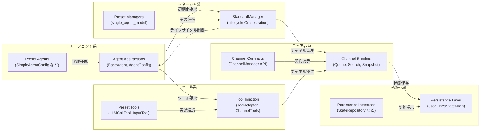

# ライブラリ構造マップ

この資料は、エージェント・マネージャ・チャネルなどライブラリ内部の主要コンポーネントと依存関係をマーメイド図で俯瞰します。ディレクトリ構成については `docs/directory_structure.md` を参照してください。

## Mermaid 図

## コンポーネント概要
- **エージェント系** (`Agent Abstractions`, `Preset Agents`) : エージェントのライフサイクル定義とプリセットによる具体的な初期化方法を提供します。
- **マネージャ系** (`StandardManager`, `Preset Managers`) : 複数チャネルやエージェントの制御を担い、プリセットで即利用できる orchestration を定義します。
- **チャネル系** (`Channel Contracts`, `Channel Runtime`) : メッセージキューや検索・参加処理を束ね、マネージャから呼び出される具体実装を提供します。
- **永続化系** (`Persistence Interfaces`, `Persistence Layer`) : チャネルやエージェント状態の保存契約と既定実装を示し、ランタイムが永続化戦略を切り替えやすくします。
- **ツール系** (`Tool Injection`, `Preset Tools`) : エージェントへツール群を注入する仕組みと、プリセットで用意した代表的なツール実装をまとめています。
- **プリセット基盤** (`Presets Package`) : 個別概念を組み合わせた構成テンプレートを提供し、利用者が設定なしでフレームワークを試せるようにします。
