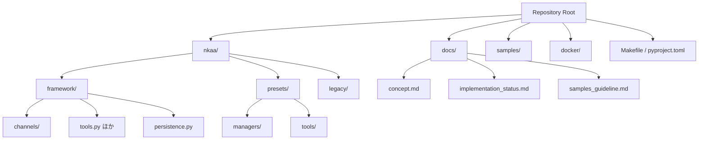

# ライブラリ構造マップ

この資料は、本リポジトリの主要ディレクトリがどのように役割分担されているかをマーメイド図で俯瞰します。詳細や運用ルールは既存ドキュメント（`docs/directory_structure.md`・`docs/concept.md` など）を参照してください。

## Mermaid 図

## ディレクトリ概要
- `nkaa/framework/` : エージェントやチャネルの基盤クラス・永続化レイヤーを提供します。
- `nkaa/presets/` : 既成のマネージャやツールを束ね、簡易セットアップを可能にします。
- `nkaa/legacy/` : 旧実装群。現行コードから参照するのみで改変しません。
- `docs/` : 設計資料・進捗管理・運用ガイドを格納します。
- `samples/` : フレームワークの利用例とチュートリアルを配置します。
- `docker/` : 追加コンポーネント（例: チャンネル永続化用 DB）の開発環境設定を保持します。
- `Makefile` / `pyproject.toml` : ビルド・依存管理・CI 用コマンドを定義します。
