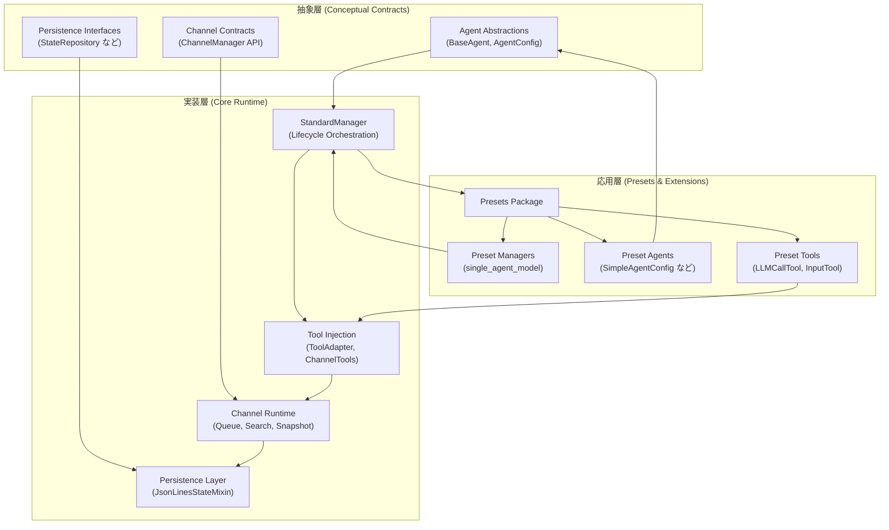

# ライブラリ構造マップ

この資料は、エージェント・マネージャ・チャネルなどライブラリ内部の主要コンポーネントと依存関係をマーメイド図で俯瞰します。ディレクトリ構成については `docs/directory_structure.md` を参照してください。

## Mermaid 図

## コンポーネント概要
- **抽象層** (`Agent Abstractions`, `Channel Contracts`, `Persistence Interfaces`) : ライブラリ全体で共有されるインタフェースや契約を提示し、実装層やプリセットが従うべき境界を定義します。
- **実装層** (`StandardManager`, `Channel Runtime`, `Persistence Layer`, `Tool Injection`) : 抽象層の契約に沿った実装を提供し、ランタイムでのチャネル管理やツール注入を担います。
- **応用層** (`Presets Package`, `Preset Managers`, `Preset Agents`, `Preset Tools`) : 実装層を組み合わせた再利用可能なセットを提供し、利用者が即座に活用できる構成を提示します。
